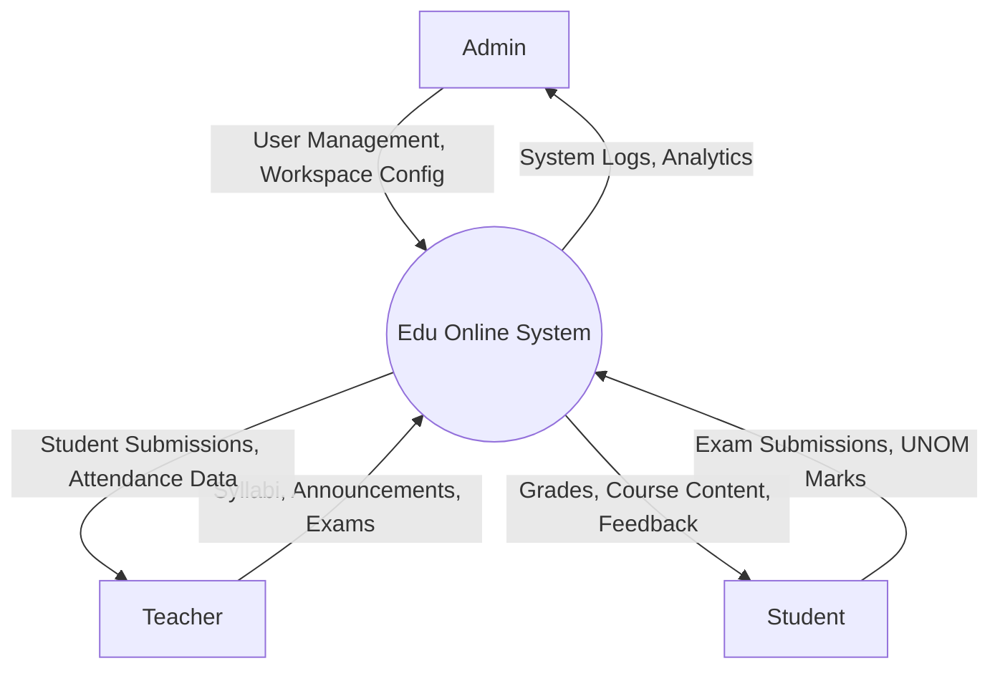
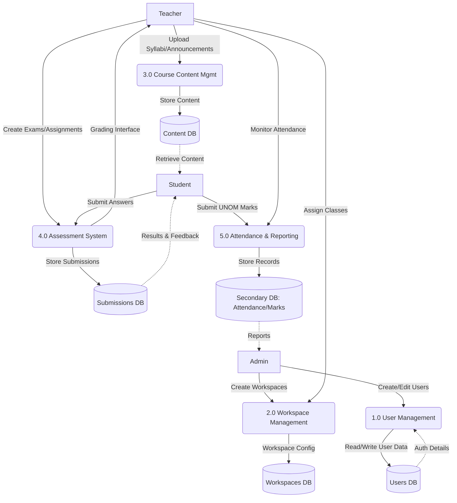
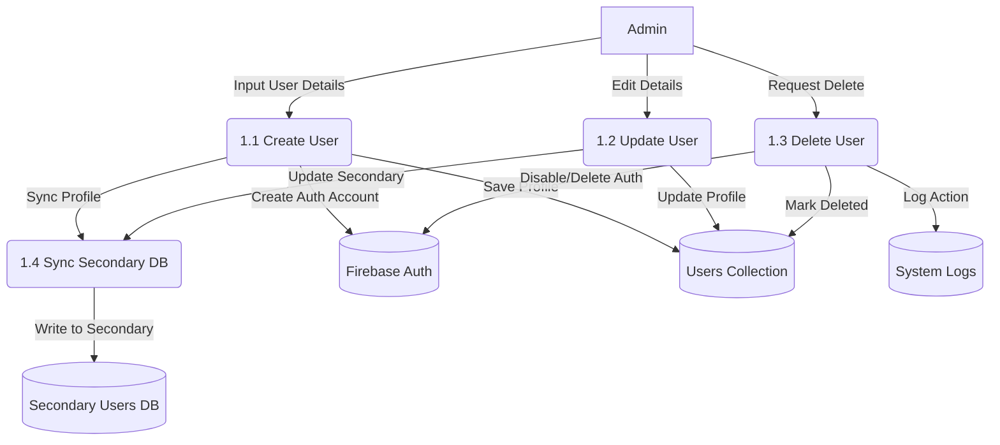
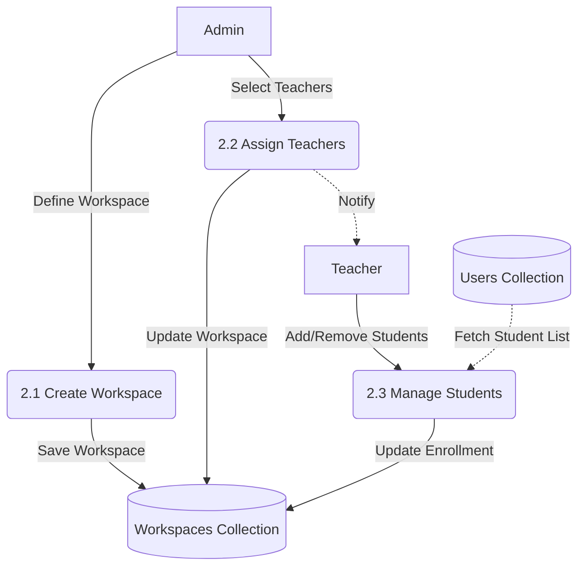
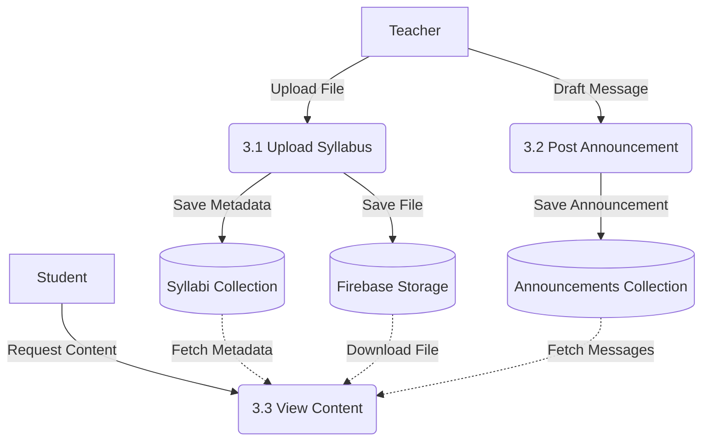
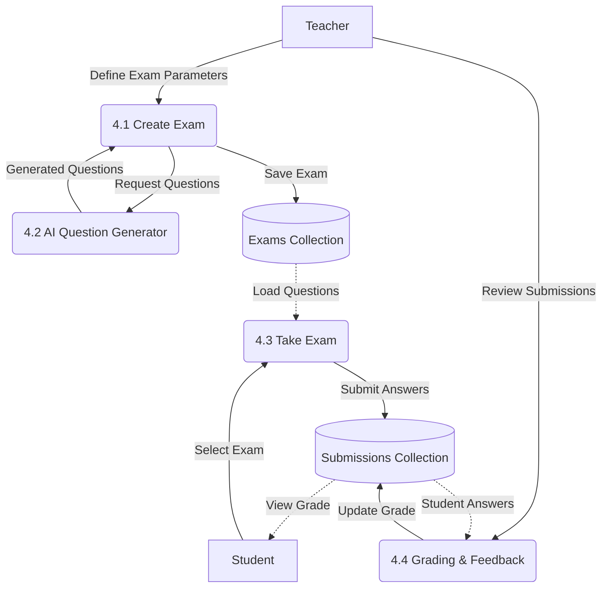
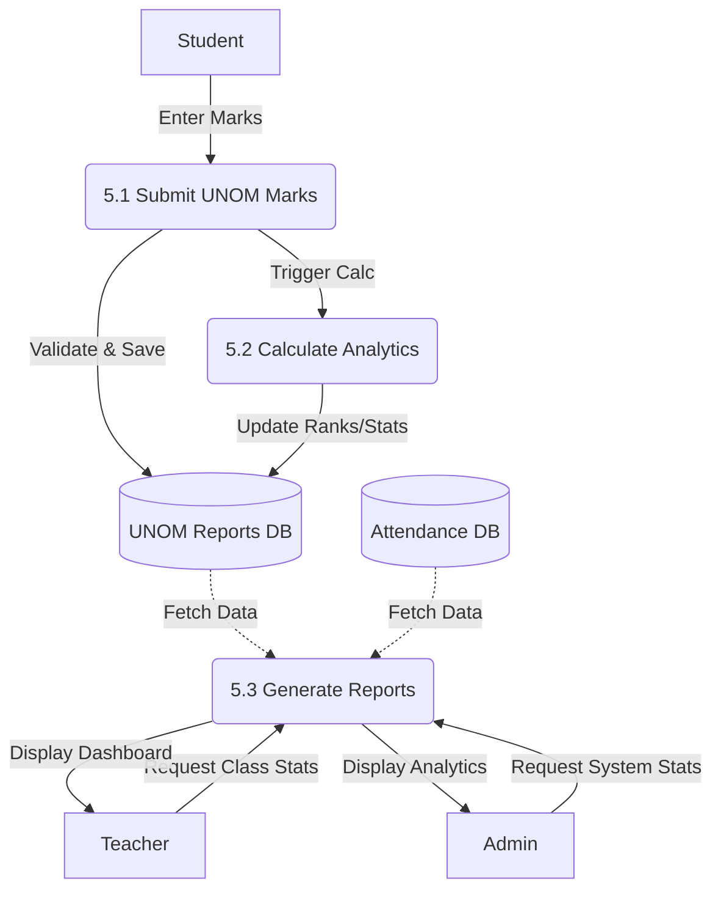

# Data Flow Diagrams (DFD) - Edu Online

This document outlines the Data Flow Diagrams for the Edu Online project, covering Level 0 (Context), Level 1 (System Decomposition), and Level 2 (Detailed Process).

## Level 0 DFD: Context Diagram

The Context Diagram represents the entire **Edu Online System** as a single process, interacting with external entities (Admin, Teacher, Student).

## Level 1 DFD: System Decomposition

This level breaks down the main system into its primary functional processes.

## Level 2 DFD: User Management (Process 1.0)

Detailed breakdown of how users are created, managed, and authenticated.

## Level 2 DFD: Workspace Management (Process 2.0)

Breakdown of how workspaces (classes/departments) are managed.

## Level 2 DFD: Course Content Management (Process 3.0)

Details on how educational content is handled.

## Level 2 DFD: Assessment System (Process 4.0)

A detailed breakdown of the **Assessment System**, highlighting the interaction between manual creation, AI generation, and grading.

## Level 2 DFD: Attendance & Reporting (Process 5.0)

Breakdown of the UNOM marks submission and attendance tracking.

